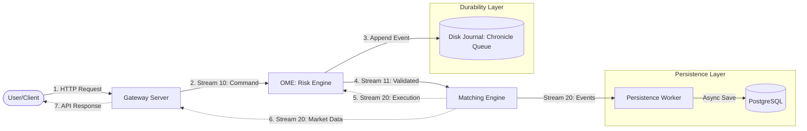

# Exchange Engine (High-Performance Matching Engine)

> **Extreme Low Latency (< 100µs) & High Throughput (100k+ TPS)**  
> Built with Kotlin, Aeron, LMAX Disruptor, and SBE (Simple Binary Encoding).

## 🚀 Overview

This project implements a next-generation cryptocurrency exchange matching engine designed for high-frequency trading (HFT). It overcomes the limitations of traditional RDB-based systems by adopting an **In-Memory**, **Zero-GC**, and **Event Sourcing** architecture.

### Key Principles
*   **In-Memory Computing:** All matching and risk checks happen in RAM. Disk I/O is removed from the critical path.
*   **Event Sourcing (Journaling):** Every input command is persisted to a memory-mapped file (**Chronicle Queue**) before/during processing. This file is the **Source of Truth**.
*   **Deterministic Replay:** If the system crashes, the entire state (balances and order books) can be 100% recovered by replaying the journal files.
*   **Zero-GC:** Uses Off-heap memory, Object Pooling, and Primitive Collections to prevent Stop-the-World GC pauses.
*   **Concurrency Isolation:** Risk Engine (OME) and Matching Engine (ME) are physically separated and communicate via shared memory (Aeron IPC).

---

## 🏗 Architecture

The system follows a reactive, message-driven architecture. Every command is journaled to disk for durability:



### Components
1.  **Gateway:** Protocol translation (REST <-> SBE), Authentication, Market Data Caching.
2.  **OME (Order Management Engine):** Pre-trade risk checks, Asset locking, and **Journaling** commands to disk.
3.  **Journal (Chronicle Queue):** Append-only, memory-mapped file storing every system event for recovery.
4.  **ME (Matching Engine):** Limit Order Book (LOB) management, Order matching execution.
5.  **Persistence Worker:** Asynchronously persists orders, trades, and balances to PostgreSQL for historical query.

---

## 🛠 Tech Stack

*   **Language:** Kotlin (JVM Target 21+)
*   **Messaging:** [Aeron](https://github.com/real-logic/aeron) (Low-latency UDP/IPC)
*   **Journaling:** [Chronicle Queue](https://github.com/OpenHFT/Chronicle-Queue) (Memory-mapped files)
*   **Intra-thread:** [LMAX Disruptor](https://github.com/LMAX-Exchange/disruptor) (RingBuffer)
*   **Serialization:** [SBE (Simple Binary Encoding)](https://github.com/real-logic/simple-binary-encoding)
*   **Storage:** PostgreSQL (Async persistence)

---

## ⚡ Quick Start

### Prerequisites
*   Java JDK 21+
*   Docker (for PostgreSQL)

### 1. Start Database
```bash
docker run --name exchange-db -e POSTGRES_PASSWORD=pass -p 5432:5432 -d postgres:15
```

### 2. Build Project
```bash
./gradlew shadowJar
```

### 3. Run System
Starts Gateway, OME, ME, and Worker in a single script.
```bash
./run-local.sh
```

### 4. Run Tests
*   **Basic Trading:** `./test-scenario.sh`
*   **OrderBook & Risk:** `./test-orderbook.sh`
*   **Cancellation:** `./test-cancel.sh`

---

## 📚 API Reference (8080)

| Method | Endpoint | Body (CSV Format) | Description |
| :--- | :--- | :--- | :--- |
| `POST` | `/deposit` | `userId,currencyId,amount` | Deposit funds |
| `POST` | `/order` | `userId,symbolId,price,qty,side` | Place Limit Order |
| `POST` | `/cancel` | `userId,orderId,symbolId` | Cancel active order |
| `GET` | `/orderbook` | `?symbolId=1` | Get OrderBook Snapshot |

---

## 🔮 Roadmap

### Phase 2: Advanced Trading Features
*   **Market Orders & Stop Orders:** Support for immediate execution and trigger-based orders.
*   **GTC/IOC/FOK:** Support for different Time-In-Force options.

### Phase 3: Scalability & Real-time
*   **Redis Pub/Sub & WebSockets:** Decouple Gateway and provide real-time push for orderbooks and trades.
*   **Recovery Engine:** Automated state recovery from `ome-journal/` files on startup.

### Phase 4: Production Readiness
*   **FIX Protocol Support:** Institutional connectivity via QuickFIX/J.
*   **Aeron Cluster:** Multi-node consensus (Raft) for high availability.
